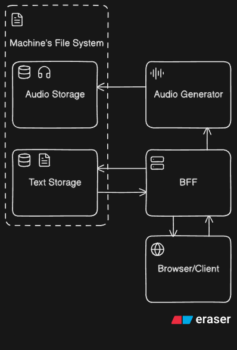

# Audiofier TTS

Audiofier is a local-first app for turning Markdown lessons into generated audio. It gives you a browser UI for organizing lesson text, previewing Markdown, selecting a voice, and sending the cleaned text to a local model-selectable TTS audio generator.

The project is intentionally local: lesson source files live on your machine, generated WAV/MP3 files stay on your machine, and the web app talks to local services only.

## What It Does

- Stores lesson groups and chapter Markdown in local files.
- Cleans Markdown into speech-friendly text before synthesis.
- Splits long lessons into safe text chunks for Kokoro.
- Generates WAV audio and converts it to MP3 by default.
- Tracks generated audio metadata separately from source Markdown.
- Provides both a web workflow and a Python CLI for direct generation.

## Architecture



The browser talks to the TanStack Start BFF. The BFF owns app workflows: reading and writing lesson text, storing metadata, and queueing audio generation. The Python audio generator only receives text and generation options, then writes generated audio files back to local storage.

Main runtime flow:

1. Browser/client calls the BFF through TanStack server functions.
2. BFF reads and writes Markdown lesson content in text storage.
3. BFF sends cleaned lesson text and voice options to the audio generator.
4. Audio generator synthesizes WAV/MP3 output and stores it in audio storage.
5. BFF records generated audio metadata for the UI.

## Technology Stack

- **Web app:** TanStack Start, TanStack Router, TanStack Form, React, Vite.
- **Validation:** Zod schemas shared between forms, server functions, and storage parsing.
- **Styling:** Tailwind CSS with local UI components.
- **Markdown preview:** `marked`, with raw HTML escaped and unsafe URLs blocked.
- **Audio generation:** Python service using Kokoro.
- **Audio output:** WAV via `soundfile`, MP3 conversion through FFmpeg.
- **Monorepo tooling:** npm workspaces and Turborepo.
- **Quality checks:** ESLint, Prettier, Ruff, TypeScript, Python compile checks, Python unittest.

## Running Locally

Use Node through nvm and npm for this repository. The root `package.json` and `package-lock.json` are the source of truth for JavaScript dependencies.

From the repository root:

```powershell
npm install
npm run setup:audio
npm run dev
```

Open:

```text
http://localhost:3000
```

`npm run dev` starts both the TanStack Start app and the local Python audio generator through Turborepo.

You can also run each side separately:

```powershell
npm run dev:web
npm run dev:audio
```

The audio generator listens locally by default:

```text
http://127.0.0.1:8765
```

If the audio generator uses another URL, set this before starting the web app:

```powershell
$env:AUDIO_GENERATOR_URL = "http://127.0.0.1:8765"
npm run dev
```

## Local Requirements

- Node `24.x`
- npm `11.x`
- Python `3.12`
- FFmpeg for MP3 output
- SoX for Qwen TTS development

Kokoro English generation uses the spaCy `en_core_web_sm` model through `misaki`; `audio-generator/requirements.txt` installs it explicitly so generation does not try to download it at runtime.

The Python virtual environment is created at:

```text
audio-generator/.venv
```

Do not copy this virtual environment between machines or repo locations. If the repo moves, recreate it:

```powershell
Remove-Item -LiteralPath .\audio-generator\.venv -Recurse -Force
npm run setup:audio
```

If the Python launcher cannot find Python 3.12, create the venv manually:

```powershell
cd .\audio-generator
& "$env:LOCALAPPDATA\Programs\Python\Python312\python.exe" -m venv .venv
.\.venv\Scripts\Activate.ps1
python -m pip install -r requirements.txt
python -m pip install -r requirements-dev.txt
deactivate
cd ..
```

For VS Code/Pylance, select:

```text
audio-generator\.venv\Scripts\python.exe
```

## Local Model Assets

Runtime model files and AI caches belong in the project-local ignored folder:

```text
.local-tts-ai/
  models/kokoro-82m/
  models/qwen3-tts-0-6b-custom/
  models/qwen3-tts-1-7b-custom/
  models/qwen3-tts-tokenizer-12hz/
  tools/ffmpeg.exe
  tools/sox/sox.exe
  cache/huggingface/
  cache/torch/
```

`.local-tts-ai/` is ignored by Git. Do not commit model weights, Hugging Face caches, Torch caches, generated audio, logs, or virtual environments.

Download models manually from the repository root:

```powershell
huggingface-cli download hexgrad/Kokoro-82M --local-dir ".local-tts-ai\models\kokoro-82m"
huggingface-cli download Qwen/Qwen3-TTS-12Hz-0.6B-CustomVoice --local-dir ".local-tts-ai\models\qwen3-tts-0-6b-custom"
huggingface-cli download Qwen/Qwen3-TTS-12Hz-1.7B-CustomVoice --local-dir ".local-tts-ai\models\qwen3-tts-1-7b-custom"
huggingface-cli download Qwen/Qwen3-TTS-Tokenizer-12Hz --local-dir ".local-tts-ai\models\qwen3-tts-tokenizer-12hz"
```

If Hugging Face authentication is needed:

```powershell
huggingface-cli login
```

The audio generator defaults caches into `.local-tts-ai/cache`. You can override local paths before starting the API:

```powershell
$env:KOKORO_MODEL_PATH = ".local-tts-ai\models\kokoro-82m"
$env:QWEN_TTS_MODEL_PATH = ".local-tts-ai\models\qwen3-tts-0-6b-custom"
$env:QWEN_TTS_1_7B_MODEL_PATH = ".local-tts-ai\models\qwen3-tts-1-7b-custom"
$env:QWEN_TTS_TOKENIZER_PATH = ".local-tts-ai\models\qwen3-tts-tokenizer-12hz"
$env:FFMPEG_PATH = ".local-tts-ai\tools\ffmpeg.exe"
$env:HF_HOME = ".local-tts-ai\cache\huggingface"
$env:TORCH_HOME = ".local-tts-ai\cache\torch"
```

Kokoro remains the default TTS model. Qwen is used only when the request selects model `qwen-0.6b-custom` or `qwen-1.7b-custom` with supported speakers `Ryan` or `Aiden`. `QWEN_TTS_MODEL_PATH` is the compatibility override for the 0.6B model; use `QWEN_TTS_0_6B_MODEL_PATH` or `QWEN_TTS_1_7B_MODEL_PATH` when you want model-specific overrides.

For MP3 output, install FFmpeg and either add it to PATH or keep it project-local at:

```text
.local-tts-ai/tools/ffmpeg.exe
```

Qwen TTS also expects SoX to be available as a command-line tool. Keep it project-local at:

```text
.local-tts-ai/tools/sox/sox.exe
```

The audio generator prepends `.local-tts-ai/tools` and `.local-tts-ai/tools/sox` to `PATH` at startup. If your local FFmpeg is somewhere else, set `FFMPEG_PATH` to the executable path before starting the audio generator.

`flash-attn` is an optional Qwen acceleration dependency. Install it only when a prebuilt wheel matches the active Python, PyTorch, CUDA, and Windows platform versions. A source build needs the CUDA toolkit and compiler setup; it is intentionally not required for normal setup.

## Storage Model

Audiofier keeps source text and generated audio separate.

Text storage:

```text
storage/markdowns/groups/
```

Each group has metadata and chapter files:

```text
storage/markdowns/groups/my-book/
  group.json
  chapters/
    introduction.json
    introduction.md
```

Audio storage:

```text
storage/generated/groups/
```

Generated audio is ignored by Git so large WAV and MP3 files do not get committed by accident. Markdown source files are not ignored, so you can choose when lesson content should be versioned.

## Audio Generation

The web app sends chapter Markdown to the BFF. The BFF sends the text to the Python audio generator, which:

1. strips common Markdown syntax,
2. preserves natural paragraph and sentence boundaries,
3. splits long text into Kokoro-safe chunks,
4. synthesizes chunk audio,
5. merges chunks into a final WAV,
6. converts the WAV to MP3 unless `wavOnly` is enabled.

The audio generator is a FastAPI service. Its main local API routes are:

```text
GET  /health
GET  /models
GET  /models/{model_id}/voices?language=english
POST /jobs
GET  /jobs/{job_id}
```

FastAPI exposes Swagger/OpenAPI documentation at:

```text
http://127.0.0.1:8765/docs
```

Current English defaults:

```text
voice: af_heart
model_id: kokoro
lang_code: a
speed: 1.0
```

Kokoro also performs internal phoneme-level chunking. Audiofier's chunking exists to keep long-form lessons manageable and to preserve intentional pauses between larger text sections.

## Writing Markdown For TTS

Write lessons as spoken prose first and rendered Markdown second.

For copied PDF, Wikipedia, documentation, or book text, use the cleanup prompt in
[`docs/prompts/lesson-format-prompt.md`](docs/prompts/lesson-format-prompt.md).

Recommended:

- Use headings for structure.
- Use complete sentences.
- Keep paragraphs natural.
- Use bullets only when each bullet reads well aloud.
- Prefer explanatory prose over tables, raw links, footnotes, and code blocks.

Avoid this when you want natural speech:

```md
| API    | Result |
| ------ | ------ |
| GET /x | 200    |

[1] https://very-long-url.example.com

- auth
- db
- cache
```

Prefer:

```md
The system has three main parts: authentication, database access, and caching.

The API returns a successful response when the request is valid.
```

## CLI Usage

Use the shell-neutral npm script from the repository root:

```powershell
npm run generate -w audiofier-audio-generator -- .\audio-generator\lessons\sample.md --wav-only
```

PowerShell and cmd can also use the Windows launcher:

```powershell
.\audio-generator\tts.cmd .\audio-generator\lessons\sample.md --wav-only
```

Common options:

```text
input                 Path to a .md or .txt file
--output-dir          Base folder for generated lesson folders
--voice               Kokoro voice, for example af_heart
--speed               Speech speed, for example 0.95 or 1.05
--lang-code           Kokoro language code
--repo-id             Model repo id
--max-chars           Max chars per chunk before extra splitting
--pause-ms            Silence between chunks in milliseconds
--keep-chunks         Save individual chunk wav files
--wav-only            Skip MP3 conversion and save only the WAV file
--ffmpeg-path         Full path to ffmpeg.exe if not in PATH or Downloads
--mp3-bitrate         MP3 bitrate, for example 96k or 128k
```

## Development Commands

Run checks before committing:

```powershell
npm run format:check
npm run lint
npm run typecheck
npm run test
npm run build
```

Command responsibilities:

- `format:check` runs Prettier and Ruff formatting checks.
- `lint` runs ESLint and Ruff.
- `typecheck` runs TypeScript checks and Python compile checks.
- `test` runs Python regression tests.
- `build` runs the production web build and Python compile check.

## Repository Layout

The important workspaces are:

```text
web/                TanStack Start app, BFF server functions, UI components
audio-generator/    Python Kokoro audio generator service and CLI
storage/            Local source text and generated audio metadata/output
docs/assets/        Documentation images and diagrams
```

The repository is a local application workspace, not a hosted SaaS layout. Runtime data belongs in `storage/`; generated audio remains local unless you intentionally copy or commit it.
